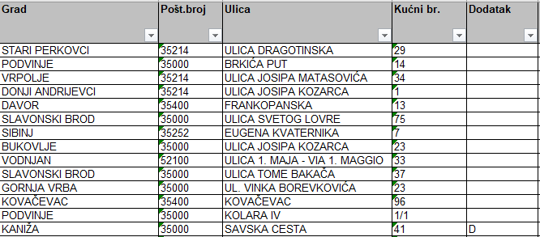
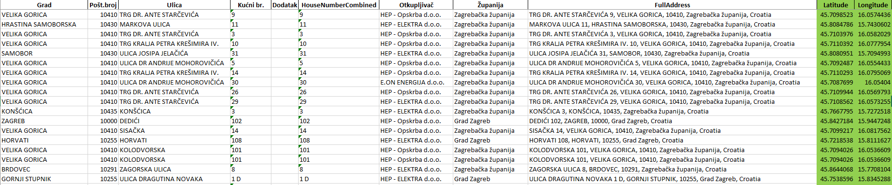

#### Proizvodaci_300425_V2.xlsx

Dostavljena datoteka koja sadrži podatke o proizvodačima rastavljena je po
distribucijskim područjima te je za svaki DP napravljeno geokodiranje lokacije
proizvođača pomoću polja adrese:
- Grad, Poštanski broj, Ulica, Kućni broj i Dodatak

Za potrebe geokodiranja adresa dostupno je nekoliko javnih i komercijalnih rješenja:

1. Nominatim servis (OpenStreetMap) - besplatna, open source opcija. Dobra za opću
upotrebu, ali nepouzdan u slučaju nepotpunih adresa ili ruralnih područja. Ograničen 
pravilima o brzini upita (1 zahtjev po sekundi.)
2. HERE/Bing/TomTom - komercijalni visoko precizni servis čije korištenje
zahtjeva plaćenu licencu
3. Google Maps API - provjerena točnost i pouzdanost u hrvatskom prostoru, osobito
u ruralnim područjima. Nema problema s dijakritičkim znakovima, limit od 50 zahtjeva po 
sekundi je prihvatljiv. Plaćeno rješenje nakon prijeđenog broja zahtjeva.

Konačno je odabran **Google Maps Geocoding API** koji za danu adresu vraća geografsku
širinu i dužinu u WGS 84 sustavu. 

Iako je Google Maps API pokazao visoku razinu točnosti u geokodiranju, u praksi su 
se pojavili problemi kod naselja koja dijele isto ime u više županija ili kod onih naselja
čiji poštanski broj nije pravilno prepoznat od strane Googlea. 
Kako bi se smanjila mogućnost pogrešnog lociranja, u procesu geokodiranja korištena je i informacija o 
županiji kako bi se dodatno suzilo područje pretrage. Podatak o županiji izvučen je iz poštanskog broja.
Svaka adresa bila je u obliku:
- [Ulica],[Kućni broj i dodatak],[Naziv naselja],[Poštanski broj],[Županija], Hrvatska

Konačno je tablica korištena za geokodiranje izgledala kao na slici dolje.

Na slikama ispod prikazane su geografske raspodjele svih proizvođača unutar nekog
distribucijskog područja te 110 kV stanice koje su uzete u obzir prilikom povezivanja.

<iframe src="{{ "plots/bubble_snaga_4001.html" | relURL }}" width="100%" height="150" style="border:0"></iframe>

