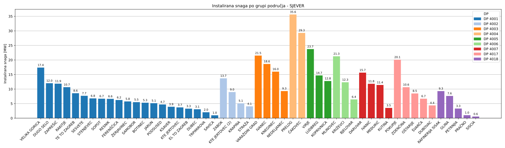
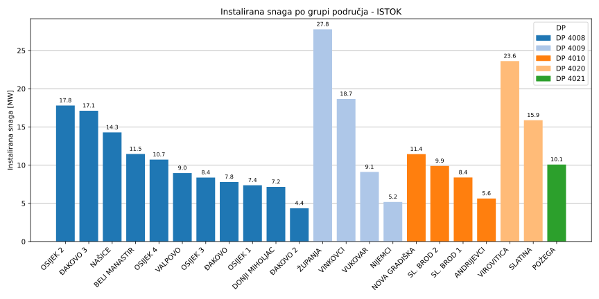
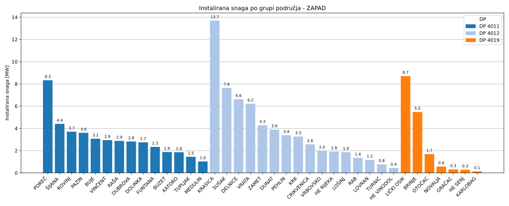
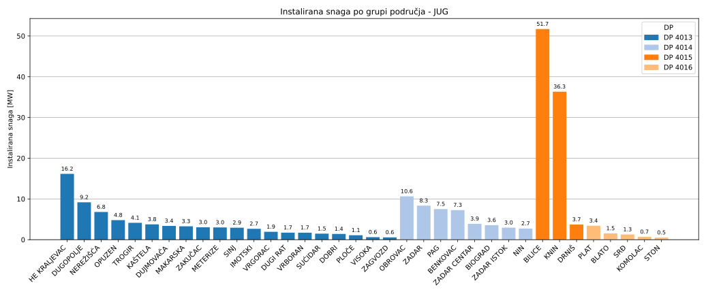

#### Metode 

Povezivanje proizvođača s pripadajućim 110 kV trafostanicama predstavlja značajan
izazov zbog složenosti i razgranatosti distribucijske mreže. Za razliku od prijenosne mreže
koja ima jasno definiranu topologiju, distribucijska mreža obuhvaća velik broj međusobno
povezanih vodova, petlji i čvorišta, pri čemu pojedini krajnji korisnici mogu biti
napajani iz više različitih pravaca, ovisno o trenutnom uklopnom stanju mreže.

Razmatrane su dvije opcije (s obzirom na nedostupnost detaljnjih podataka od strane ODS-a):
1. Povezivanje prema administrativnim granicama - nepouzdano zbog već spomenutih
preklapanja i nepravilnosti oko definiranih granica
2. Prostorno povezivanje temeljem udaljenosti - pokazalo se kao najjednostavnija 
i najpraktičnija opcija u kontekstu dostupnih podataka

Odabran je pristup povezivanja prema zračnoj udaljenosti, koristeći geografske
koordinate objekata. Dvije najčešće korištene metode u kartografiji su **Vincentyjeva formula**
i **Haversinusna formula**.
1. Vincentyjeva formula je precizna metoda za izračunavanje udaljenosti između
dvije točke na površini elipsoida (poput Zemlje). Temelji se na rješavanju inverznog 
geodetskog problema pomoću iterativnog postupka koji uzima u obzir spljoštenost 
Zemlje. Daje veoma točne rezultate i koristi se u geodeziji i kartografiji te GPS 
tehnologiji. 
2. Haversine formula (hrv. __haversinusna__) je jednostavnija metoda koja za 
pretpostavku uzima sferičnost Zemlje. Koristi osnovnu trigonometriju za procjenu 
najkraće udaljenosti. Iako nije jednako precizna kao Vincentyjeva formula, posebno
na velikim udaljenostima ili blizu polova, jednostavna je za implementaciju i dovoljno
dobra za brze procjene, pogotovo na manjim područjima kao što su hrvatska distribucijska područja.

S obzriom da visoka preciznost kakvu pruža Vincentyjeva formula nije ključna za
ovu analizu, odabrana je haversinusna formula koja je zadovoljavajuća za relativno 
mala područja poput Hrvatske, gdje je razlika između sfernog i elipsoidnog modela
minimalna.

Odabrano je da se za izračun udaljenosti koristi haversinusna formula, a postupak
odabira najbližeg susjeda proveden je pomoću **k-NN algoritma** [insert footnote] temeljenog na 
**BallTree** strukturi. Ovo rješenje ne uzima u obzir elektroenergetsku povezanost jer 
za nju nema podataka. Zbog preciznosti geokodiranja i gustoće trafostanica i dalje 
može dati dobre procijenjene rezultate za daljnje analize. 

- BallTree struktura je hijerarhijska struktura podataka koja grupira točke u "balone",
što omogućuje brzu eliminaciju velikog broja podataka prilikom traženja najbližeg susjeda
- k-NN algoritam (k-algoritam najbližih susjeda) računa "udaljenost" nekog uzorka od svih
točaka nekog seta i pronalazi određeni broj najbližih točaka (u našem slučaju jednu
najbližu točku iz seta 110/x kV trafostanica). Za računanje udaljenosti mogu se koristiti
različite metrike, ovisno o problemu, a u ovom slučaju korištena je gore opisana
haversinusna metrika za udaljenost dviju točaka na sferi.

Rezultat povezivanja su excel datoteke u kojima je svakom proizvođaču ili kupcu
s vlastitom proizvodnjom dodijeljena pripadnost 110 kV trafostanici. Na slici ispod
prikazan je primjer linestring dijagrama koji vizualno prikazuje povezanost proizvođača 
i 110/x kV trafostanice kojoj pripada.



S obzirom da su nam za daljnje analize potrebne sumarne vrijednosti po trafostanicama, na slikama ispod
prikazan je stupčasti dijagram koji prikazuje konačnu raspodjelu distribuirane proizvodnje po grupama područja.

[1] Korištena skripta za balltree - assign-ts-to-solar.py

[2] Korištena skripta za linestring - geopandas-lines.py

[3] Korištena skripta za lines html - change-plt-to-plotly-linestring-diagrams.py