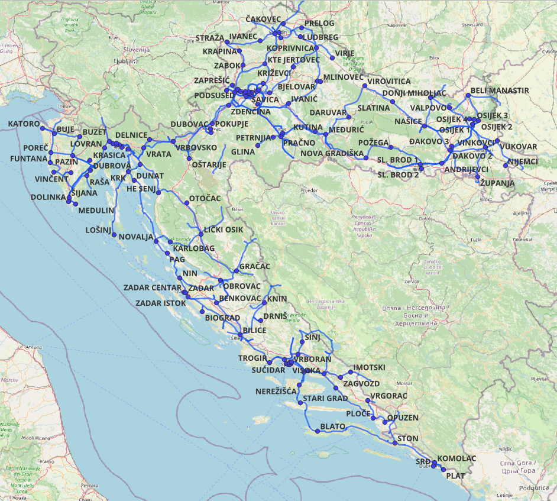

#### QGIS podatci 

Nakon jednostavnog pregleda stanja potrebno je napraviti povezivanje svih 
proizvođača po 110 kV trafostanicama, za što su korišteni razni izvori podataka, 
uključujući i dostavljene PSS/E datoteke, QGIS te javno dostupne prethodno 
preuzete podatke HOPS-a iz Sustava katastra infrastrukture.

S obzirom da se u 110 kV prijenosnoj mreži nalazi velik broj 110 kV čvorišta 
koja su samo za priključenje raznih proizvođača, čvorištima je dodjeljena informacija
o pripadajućem distribucijskom području, prema 10G planu HEP ODS-a. 

Iz QGIS-a, shapefile 110 kV stanica eksportiran je kao geojson format.

[1] Korišteni izvor: Sustav katastra infrastrukture - WPS 400,220,110 kV mreža

U tablici ispod dan je isječak iz konačnog .csv dokumenta (skripta geojson-to-csv.py).
Prema podatcima HEP ODS-a, svakoj 110 kV trafostanici pridruženo je distribucijsko područje koje stanica napaja.
KTE Jertovec napaja potrošače u dva distribucijska područja - područje Elektre Zagreb i Elektre Zabok te je dodana
kao mogućnost za povezivanje proizvođača i stanice u oba DP-a.

Iz tablice je vidljivo i da je iz QGIS-a dostupan podatak i o geografskoj širini i 
dužini u koordinatnom sustavu EPSG: 4326 - WGS 84. Odabran je taj sustav umjesto EPSG: 3765 HTRS96/TM
kako bi se kasnije bez transformacija lakše povezao s koordinatama pojedinačnih proizvođača, čije će se koordinate
izvući koristeći Google Maps sustav pozicioniranja (objašnjeno u sljedećoj točki dokumentacije). 

|busNumber|busName |baseVoltage|typeCode|substationName|DP  |DP2|longitude  |latitude   |
|---------|--------|:---------:|:------:|:------------:|:--:|---|:---------:|:---------:|
|60000    |HANDRI51|110        |1       |ANDRIJEVCI    |4010|   |18.29251486|45.19170309|
|70000    |HANDRI52|110        |1       |ANDRIJEVCI    |4010|   |18.29256282|45.19171869|
|60001    |HBENKO5 |110        |1       |BENKOVAC      |4014|   |15.62751703|44.02751068|
|60003    |HBILIC5 |110        |1       |BILICE        |4015|   |15.9025698 |43.75724771|
|60004    |HBIOGR5 |110        |1       |BIOGRAD       |4014|   |15.46073831|43.95026472|
|60005    |HBJELO5 |110        |1       |BJELOVAR      |4006|   |16.81861113|45.89881545|
|60178    |HBLATO5 |110        |1       |BLATO         |4016|   |16.7999609 |42.94769058|
|60006    |HBMANA5 |110        |1       |BELI MANASTIR |4008|   |18.62732885|45.75884168|
|60007    |HBOTIN51|110        |1       |BOTINEC       |4001|   |15.95445991|45.76437756|
|70007    |HBOTIN52|110        |1       |BOTINEC       |4001|   |15.95377011|45.76435621|
|60008    |HBRINJ2 |220        |2       |BRINJE        |4019|   |15.10508422|44.99309905|

Navedena karta povezana je s dokumentom [Informacija o mogućnosti priključenja](https://www.hep.hr/ods/UserDocsImages/dokumenti/Pristup_mrezi/Info%20o%20mogucnostima%20prikljucenja/Hosting_Capacity_final10_2025_PrilogIiII.pdf).
te Desetogodišnjim planom HEP ODS-a [10g plan]().

